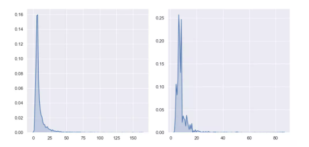
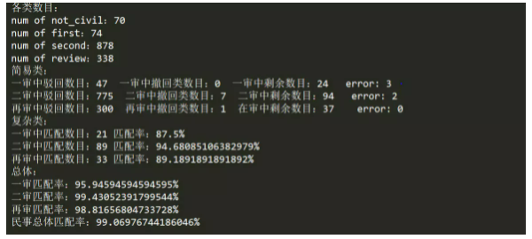

# Legal Cases Data Analysis (Chinese legal cases)
> ***This project deals with legal datasets in Chinese!***

### Part 0: Establishing different extraction rules for criminal and civil cases

[Detailed Chinese version about this part](https://shimo.im/docs/Pt9KPJggJGKV86Dv)

- Criminal

  - First instance

    - Extract the request:
      The extraction of the petition information mainly refers to the "trial process"; the main format is: xx procuratorate accuses xx of xx (keyword) crime in the xx indictment (there may be more than one)
    - /image-20220324141928518.png)
    - Extract the response:
      The extraction of response information mainly refers to "this court thinks"; the format is mainly: its behavior has constituted xx (keyword) crime (maybe more than one)
    - /image-20220324142016274.png)
    - Check if it matches:
      Match keywords extracted from requests and responses.

  - Second instance

    - Extract the request:

      - Priority should be given to "The Public Prosecution Authority/Appellant's Complaint", if there is no one of these two items, go to "Hearings"
      - The petition (keywords) can be divided into: 1. Withdrawal of the appeal 2. Protest opinion/appearance opinion (inspectorate) 3. Dissatisfied appeal/appeal (except for keywords, if the petition is refined, it will be It is found that only one whole sentence can be extracted, and the semantics of the sentence may need to be summarized and then classified)
      - /image-20220324142200960.png)

    - Extract the response:

      - Please refer to "Reference Result" first. If the content of the judgment result cannot fully contain the appeal, please refer to "This Court believes"

      - If Appears: Appeal dismissed, original judgment affirmed, which can be considered to respond to all the plaintiff's claims

        /image-20220324142301066.png)

      - For the extraction of the response information for withdrawing the appeal, the main reference is "Judgment Results"; the main format is: XX is allowed to withdraw the appeal (it has not been found that the withdrawal is not allowed)

        /image-20220324142346831.png)

    - Check if it matches:
    
      1. If the response appears with the words "Appeal dismissed" (not dismissing the remaining appeals), it can be considered that all requests have been matched.
      2. If such words do not appear, you need to compare them according to the requested item and the response item

  - Retrial
    Because there are few retrial items, only about 20 items, according to the current observation, it is tentatively believed that the concept in the second trial can be used.

The civil part is similiar

### Part 1: Extraction and matching of the first instance of criminal cases

[Detailed Chinese version about this part](https://shimo.im/docs/RwqdVwQwT3DCjCQC)

#### Experimental results:

The match rate is 97%

Distribution of lengths of petitions and responses

### Part 2: Extraction and matching of the second instance, and retrial of criminal cases

[Detaied Chinese Version about this part](https://shimo.im/docs/8GxVxXvR6DHyKwgk)

Due to the particularity of this part of the data, we first consider the simplest and most common form: Appeal dismissed/appeal dismissed/appeal withdrawn in the response 🧐. We have already analyzed it in the note of week 1, and such a situation can be directly considered as responding to all the petitions.

#### Experimental results:

The match rate is 99%

### Part 3: Extraction and matching of the first instance, second instance, and retrial of civil cases

[Detailed Chinese Version about this part](https://shimo.im/docs/Cq8kRGkyYjyRvX9D)

- What am I looking for?

  -  I want to find out if its claim matches the response in a civil case. I would like to see the match rate and properly extract and observe the content of the petition and response.

- What do I think is a match? Why? 

  - I think that if there are words such as dismissing the appeal, dismissing the remaining appeals, or withdrawing the appeal in the response of a case, then the content of the response is greater than or equal to the content of the appeal, that is, a match. The dismissal of the appeal and the withdrawal of the appeal are obvious. For dismissing the remaining appeals, if the petitions are a, b, c, d and the response is not required e and dismiss the other petitions. In fact, for e, the rest contains a,b,c,d, so it is considered a match. (Logically, there will not be another e suddenly, it may just be a change in the form of expression, in fact, it is a response to a petition)

- What do I think is a mismatch? 

  - I think if the petition is class a,b,c and the response is class b,c,d then he doesn't match. Very few look very irregular. For example, the following one has only 2 tags, and both the petition and the response are mixed in one tag. It is very troublesome to consider such a case, and there is no need to do so.

- How did I simplify the problem? Why so simplified?

  - **Extract keywords** for petitions and responses to determine categories, and compare categories rather than content. Because the language of the civil petition is not standardized and the content of the petition has no scope, the content is relatively meaningless.
  - **Not counted and only classified into two categories:** It will not be counted twice in the category because it has to pay for mental damage and maintenance costs, or it is classified into two categories. This is because the expression of the petition is not standardized, and some people say it is Maintenance costs, some people may say car repair money, and may say another way in the response, it is difficult to match. Also, I don't know the keywords for which content was brought up as a petition. Because I have seen cases like this, I know there is a claim for maintenance fees. But if there is a petition for divorce or marriage in a case, I have not seen it before, because there is no fixed format to prompt me that a certain part in the back is a petition. If it is counted, there will be omissions. The following is an example of a petition I extracted. It can be seen that it is very personalized. If you have not seen it before, it is almost impossible to start with keywords.
  - 

- Experimental results:

  The overall match rate is 99%

  

